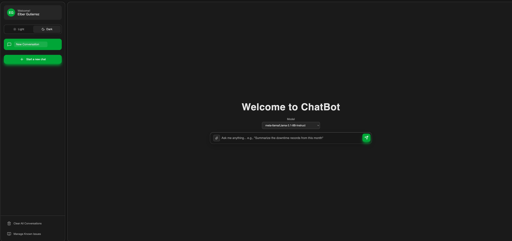
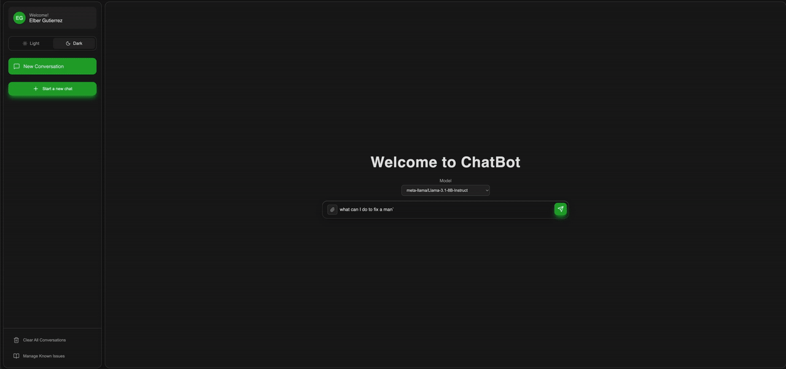
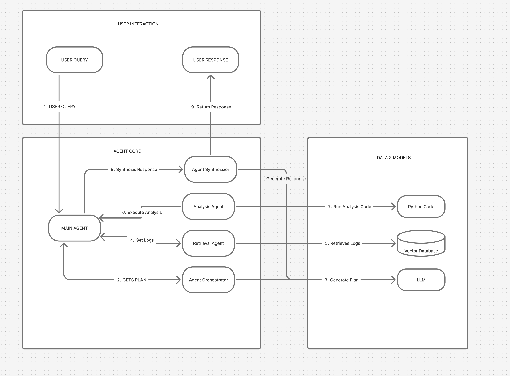

#  Downtime Agent Analyzer


**Downtime Detective** is an intelligent, multi-agent AI system designed to analyze manufacturing logs. It helps operators and engineers investigate the root causes of production downtime using natural language.

Unlike simple chatbots, this system utilizes a **RAG (Retrieval-Augmented Generation)** pipeline and an **Agentic Workflow** to dynamically plan, retrieve specific logs, analyze data using Python tools, and synthesize answers.


## Screenshots
<div align="center">
  
  <p><em>The intuitive chat interface built with React</em></p>
</div>

<div align="center">
  
  <p><em>Demo of "how to fix a sensor belt issue"</em></p>
</div>

## System Architecture

This project implements a **Multi-Agent Architecture** (`backend/agents/`) to handle complex queries.
<div align="center">
  
  <p><em>The agentic architecture</em></p>
</div>

### The Agent Workflow
1.  **Agent Orchestrator:** Uses an LLM to parse natural language into a structured execution plan (e.g., "Find logs from last week" $\rightarrow$ "Calculate top 3 errors").
2.  **Agent Retrieval:** Interfaces with **ChromaDB** (Vector Store) to perform semantic search and metadata filtering on downtime logs.
3.  **Agent Analysis:** Performs deterministic data analysis (aggregation, clustering, summing) using `pandas` and `scikit-learn`.
4.  **Agent Synthesis:** Generates a final natural language response based on the retrieved data and analysis.

### Tech Stack

**Backend**
* **Framework:** Python FastAPI
* **AI/ML:** HuggingFace Inference Client, Custom Agent Logic
* **Vector Database:** ChromaDB (for semantic search of logs)
* **Relational Database:** SQLite (for conversation history & known issues)
* **Data Processing:** Pandas, Scikit-learn

**Frontend**
* **Framework:** React (Vite)
* **State Management:** Immer / React Hooks
* **Communication:** Server-Sent Events (SSE) for real-time agent streaming


## Getting Started
### Prerequisites
* Node.js (v18 or higher)
* Python (v3.10 or higher)

### 1. Backend Setup

navigate to the backend folder, create virtual Environment, and install the dependencies:
```bash
cd backend
python3 -m venv aidowntime
source venv/bin/activate
pip install -r requirements.txt

# Seed the Database and Start the API Server
# Provided dummy data
python -m repositories.vector_chroma_db.run_and_seed_db
uvicorn main:app --reload --port 8000
```
To make queries to the app a huggingface token will be required in .env and permission to the llm models of choice through huggingface.

---

### 2. Frontend Setup
Open a new terminal and navigate to the frontend folder:

``` bash
cd frontend
# Install dependencies and start the UI:
npm install
npm run dev
# Open your browser to http://localhost:5173
```

## Project Structure
```
├── backend/
│   ├── agents/                 # Multi-agent logic (Orchestrator, Retrieval, Analysis)
│   ├── api/                    # FastAPI endpoints
│   ├── repositories/           # ChromaDB and SQLite interfaces
│   └── main.py                 # Application entry point
└── requirements.txt            # Python dependencies
├── frontend/
│   ├── src/
│   │   ├── components/         # React components (Chatbot, SidePanel)
│   │   └── assets/             # SSE parsing and API utilities

```


